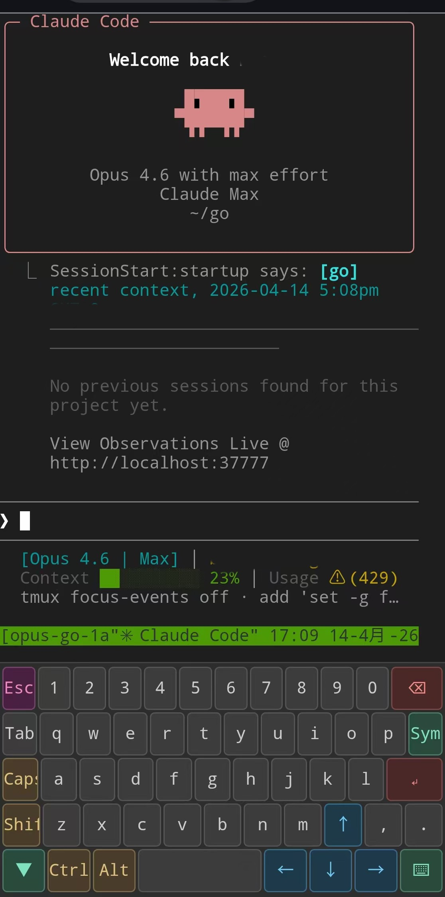

# webterminal

Lightweight web-based terminal with a mobile-friendly virtual keyboard. Single Python file, no build step. Powered by tmux for persistent sessions that survive browser disconnects.



## Features

- Full terminal via xterm.js + WebSocket, backed by tmux
- **Persistent sessions**: named sessions survive browser close and can be reattached; anonymous sessions are cleaned up automatically
- **URL parameter API**: `?name=`, `?cwd=`, `?cmd=`, `?attach=` for session control; browser tab title auto-reflects the session name
- **REST API**: list sessions, send keys, and kill sessions programmatically
- Compact key bar for touch screens: Esc, Tab, Ctrl, Alt, Shift, arrow keys, Home/End, Enter, and common Ctrl combos
- Full virtual QWERTY keyboard with symbol layer: complete letter, number, and symbol input without the phone soft keyboard
- Modifier keys (Ctrl/Alt/Shift) are toggle-style: tap to activate, then tap another key to send the combo
- Split keyboard in landscape: keys split into left/right halves for ergonomic thumb typing, with a hide/show toggle
- Orientation-aware key sizing: larger touch targets in portrait, compact layout in landscape
- Position-based rainbow flash feedback on key press
- 10,000-line scrollback buffer
- Touch-drag scrolling on mobile: one-finger drag on the terminal sends wheel events to tmux, matching desktop mouse-wheel behavior
- Soft-keyboard-aware layout: the terminal shrinks above the native keyboard on mobile Chrome, iPhone, and iPad (including older iPadOS where VisualViewport doesn't resize), so the cursor stays visible
- GPU-accelerated rendering via WebGL addon (automatic canvas fallback)
- Auto-fit terminal to viewport, responsive on resize
- Clickable URLs (web-links addon)
- HTTP Basic Auth support

## Requirements

- Python 3.10+
- [Tornado](https://www.tornadoweb.org/)
- tmux

```bash
pip install tornado
```

## Usage

```bash
python server.py
```

Open `http://<host>:7700` in a browser.

> [!WARNING]
> This app exposes an interactive shell. Do not bind it to a public network without `WEBTERMINAL_AUTH` and an additional trusted boundary such as SSH tunneling, VPN, firewall rules, or a reverse proxy with TLS.

### URL parameters

| Parameter | Description |
|---|---|
| `?name=mywork` | Create or reattach a named session |
| `?cwd=/path/to/dir` | Set initial working directory |
| `?cmd=htop` | Run a command on session start |
| `?attach=existing` | Attach to an existing tmux session |

### REST API

| Method | Endpoint | Description |
|---|---|---|
| `GET` | `/api/terminals` | List all tmux sessions |
| `POST` | `/api/terminals/:name/send` | Send keys to a session (body: `{"keys": "..."}`) |
| `DELETE` | `/api/terminals/:name` | Kill a session |

### Environment variables

| Variable | Default | Description |
|---|---|---|
| `WEBTERMINAL_PORT` | `7700` | Listen port |
| `SHELL` | System login shell, fallback `/usr/bin/bash` | Shell to spawn |
| `WEBTERMINAL_AUTH` | *(empty, disabled)* | HTTP Basic Auth in `user:pass` format |

```bash
WEBTERMINAL_PORT=8888 SHELL=/usr/bin/fish python server.py

# with login password
WEBTERMINAL_AUTH=username:userpassword python server.py
```

Note: `SHELL` reads from the system environment variable, which is your **login shell**, not necessarily the shell you launched the server from. Override it explicitly if you want a different shell.

## Mobile usage

Designed for accessing a remote machine's terminal from a mobile device (or any device with a browser).

The bottom bar provides modifier and special keys that phone soft keyboards lack. Modifier keys are sticky: tap Ctrl, then type `c` on the soft keyboard to send Ctrl-C. Drag one finger on the terminal to scroll tmux history just like a desktop mouse wheel.

Tap the ⌨ button to switch to a full virtual keyboard that suppresses the phone soft keyboard entirely. Switch to the symbol layer (Sym) for symbol input. In landscape orientation the keyboard automatically splits into left/right halves for comfortable thumb typing. Tap ▼ to hide the keyboard for browsing terminal output; a floating ⌨ button appears at the bottom-left to restore it.

## License

MIT
